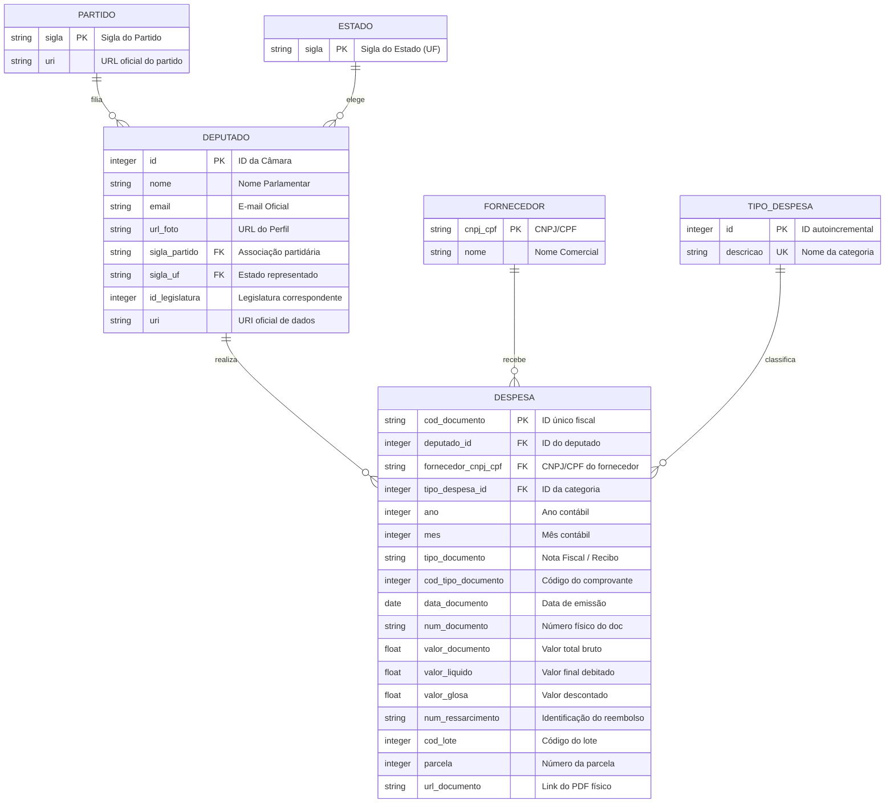

# Documentação Técnica: Banco de Dados Relacional da Transparência Parlamentar

Este documento serve como a referência técnica oficial do banco de dados estruturado do Projeto de Transparência Parlamentar (CEAP). Ele detalha a modelagem física, o dicionário de dados completo e as decisões de design adotadas para garantir integridade, desempenho e portabilidade para o uso público pela sociedade.

---

## 1. Arquitetura Física e Decisões de Design

- **Motor de Banco de Dados:** **SQLite3**
- **Codificação de Caracteres:** `UTF-8`
- **Arquivo de Banco:** `transparencia_parlamentar.db`
- **Integridade Referencial:** Enforcada ativamente por meio de `FOREIGN KEY`s relacionais ativadas por trigger de conexão (`PRAGMA foreign_keys = ON;`).
- **Normalização:** A base foi projetada seguindo as diretrizes da **Terceira Forma Normal (3NF)**. Dados repetitivos de Deputados, Partidos, Fornecedores e Categorias de Despesa foram extraídos para tabelas cadastrais secundárias (Dimensões), restando na tabela principal `despesa` (Fatos) apenas as chaves relacionais e os valores contábeis de cada nota fiscal.
- **Portabilidade:** Ao usar SQLite, o banco de dados inteiro consiste em um único arquivo. Isso viabiliza sua portabilidade cívica, permitindo que pesquisadores baixem a base e a utilizem sem configurações complexas de servidor.

---

## 2. Diagrama Entidade-Relacionamento (ER)

O relacionamento entre as entidades é de 1 para Muitos (`1:N`). Um partido abriga muitos deputados; um estado elege muitos deputados; um deputado realiza muitas despesas.



---

## 3. Dicionário de Dados Detalhado

### 3.1. Tabela `partido`
Armazena as siglas dos partidos políticos dos deputados investigados.

| Campo | Tipo no SQLite | Restrições | Descrição |
| :--- | :--- | :--- | :--- |
| `sigla` | `VARCHAR(10)` | `PRIMARY KEY` | Sigla curta e única do partido (ex: 'MDB', 'PT'). |
| `uri` | `TEXT` | Nenhuma | URL de acesso aos detalhes do partido na API oficial. |

### 3.2. Tabela `estado`
Armazena a Unidade Federativa de representação dos deputados.

| Campo | Tipo no SQLite | Restrições | Descrição |
| :--- | :--- | :--- | :--- |
| `sigla` | `CHAR(2)` | `PRIMARY KEY` | Sigla de duas letras da UF (ex: 'SP', 'RJ', 'AP'). |

### 3.3. Tabela `deputado`
Cadastro completo dos parlamentares federais investigados.

| Campo | Tipo no SQLite | Restrições | Descrição |
| :--- | :--- | :--- | :--- |
| `id` | `INTEGER` | `PRIMARY KEY` | Identificador único oficial fornecido pela Câmara. |
| `nome` | `VARCHAR(150)` | `NOT NULL` | Nome parlamentar adotado. |
| `email` | `VARCHAR(150)` | Nenhuma | Endereço de e-mail institucional oficial. |
| `url_foto` | `VARCHAR(255)` | Nenhuma | Link público para a foto de identificação oficial. |
| `sigla_partido`| `VARCHAR(10)` | `FOREIGN KEY` | Partido de filiação do parlamentar (`REFERENCES partido(sigla)`). |
| `sigla_uf` | `CHAR(2)` | `FOREIGN KEY` | Estado que elegeu o deputado (`REFERENCES estado(sigla)`). |
| `id_legislatura`|`INTEGER` | Nenhuma | Identificador da Legislatura (ex: 57). |
| `uri` | `TEXT` | Nenhuma | Link direto da API para informações detalhadas. |

### 3.4. Tabela `fornecedor`
Cadastro de estabelecimentos comerciais, prestadores de serviços e empresas que emitiram notas fiscais indenizadas pela CEAP.

| Campo | Tipo no SQLite | Restrições | Descrição |
| :--- | :--- | :--- | :--- |
| `cnpj_cpf` | `VARCHAR(20)` | `PRIMARY KEY` | Identificador tributário único da empresa ou pessoa física fornecedora. |
| `nome` | `VARCHAR(255)` | `NOT NULL` | Nome comercial / Razão social da empresa (higienizada em caixa alta). |

### 3.5. Tabela `tipo_despesa`
Tipificação das categorias de gastos permitidas pela cota de despesa da Câmara.

| Campo | Tipo no SQLite | Restrições | Descrição |
| :--- | :--- | :--- | :--- |
| `id` | `INTEGER` | `PRIMARY KEY AUTOINCREMENT` | Chave gerada automaticamente no banco. |
| `descricao` | `VARCHAR(255)` | `UNIQUE`, `NOT NULL` | Nome textual completo da categoria (ex: 'COMBUSTÍVEIS E LUBRIFICANTES'). |

### 3.6. Tabela `despesa`
Tabela central contendo os registros de gastos físicos emitidos e reembolsados.

| Campo | Tipo no SQLite | Restrições | Descrição |
| :--- | :--- | :--- | :--- |
| `cod_documento` | `VARCHAR(50)` | `PRIMARY KEY` | Identificador físico exclusivo da nota na Câmara. |
| `deputado_id` | `INTEGER` | `NOT NULL`, `FOREIGN KEY` | ID do deputado autor do gasto (`REFERENCES deputado(id)`). |
| `fornecedor_cnpj_cpf`| `VARCHAR(20)` | `FOREIGN KEY` | Identificador fiscal do fornecedor (`REFERENCES fornecedor(cnpj_cpf)`). |
| `tipo_despesa_id`| `INTEGER` | `NOT NULL`, `FOREIGN KEY` | ID do tipo de gasto (`REFERENCES tipo_despesa(id)`). |
| `ano` | `INTEGER` | `NOT NULL` | Ano contábil do gasto. |
| `mes` | `INTEGER` | `NOT NULL` | Mês contábil do gasto. |
| `tipo_documento` | `VARCHAR(100)`| Nenhuma | Descrição do tipo (ex: 'Nota Fiscal', 'Recibo'). |
| `cod_tipo_documento`|`INTEGER` | Nenhuma | Código catalogado pela Câmara. |
| `data_documento` | `DATE` | Nenhuma | Data física de emissão da nota (padrão YYYY-MM-DD). |
| `num_documento` | `VARCHAR(100)`| Nenhuma | Número de série impresso no documento físico. |
| `valor_documento`| `REAL` | `NOT NULL` | Valor bruto discriminado no documento fiscal. |
| `valor_liquido` | `REAL` | `NOT NULL` | Valor real pago e reembolsado pela cota. |
| `valor_glosa` | `REAL` | `DEFAULT 0.0` | Valor retido ou rejeitado pela contabilidade interna. |
| `num_ressarcimento`|`VARCHAR(50)` | Nenhuma | Número oficial do lote de ressarcimento. |
| `cod_lote` | `INTEGER` | Nenhuma | Código agrupador do processamento contábil. |
| `parcela` | `INTEGER` | `DEFAULT 0` | Parcela correspondente ao pagamento. |
| `url_documento` | `VARCHAR(500)`| Nenhuma | Link direto para visualizar o PDF do comprovante digitalizado. |

---

## 4. Otimização e Desempenho (Índices)

Devido ao potencial volume elevado de dados históricos, foram projetados índices secundários em chaves estrangeiras e campos de filtragem recorrente, evitando a realização de varreduras completas em tabelas (`Full Table Scans`):

1. `idx_deputado_partido` / `idx_deputado_uf`: Aceleram consultas que agrupam parlamentares por estado ou legenda.
2. `idx_despesa_deputado`: Otimiza buscas por gastos específicos de um deputado.
3. `idx_despesa_fornecedor`: Essencial para a análise e ranking de fornecedores que mais recebem verba pública.
4. `idx_despesa_tipo`: Otimiza agrupamentos por categorias de despesa.
5. `idx_despesa_data`: Indexa a linha do tempo, permitindo buscas rápidas por períodos anuais, mensais ou datas específicas.
6. `idx_despesa_valor`: Acelera a filtragem e ordenação por faixas financeiras de maior relevância contábil.

---

## 5. Camada Cívica de Abstração: `vw_despesas_completas`

Para garantir que desenvolvedores juniores, pesquisadores de dados e a sociedade em geral consigam interagir com a base de forma descomplicada, criamos uma **View Pública**. Ela simula um arquivo plano e denormalizado, contendo todas as descrições em texto e dados cadastrais unificados, sem precisar de `JOIN`s complexos.

### Consulta Simplificada (Exemplo)
```sql
-- Buscar os 5 maiores gastos com combustível de deputados do Rio de Janeiro
SELECT nome_deputado, nome_fornecedor, valor_liquido, data_documento 
FROM vw_despesas_completas 
WHERE sigla_uf = 'RJ' 
  AND tipo_despesa = 'COMBUSTÍVEIS E LUBRIFICANTES' 
ORDER BY valor_liquido DESC 
LIMIT 5;
```
